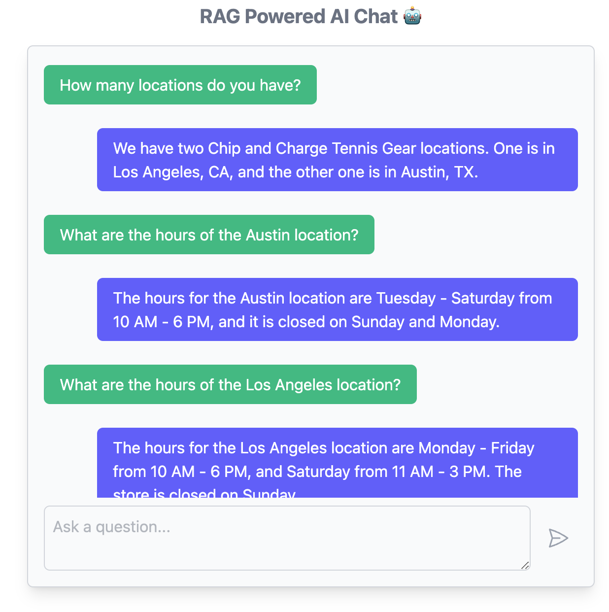

## RAG-Powered AI Chat App with Rails and Ollama

This AI chat app leverages Retrieval-Augmented Generation (RAG) to provide context that a large language model (LLM) can use to respond to prompts. Users can upload documents to the database, and a model running locally via Ollama creates embeddings for both the documents and user prompts. The Rails app then finds stored documents relevant to the user's prompts and sends them to the LLM. This eliminates the need to send API requests to OpenAI or other external services.

### Possible use cases

- A study aide that uses notes and handouts to answer questions about class material.
- A customer support bot that uses company-specific information to respond to user inquiries.
- An application that uses public studies to answer nutritional queries.

### Also...
- [Ollama](https://ollama.com/) is used to download and run the models locally via the Ollama CLI.
- The app uses the [Neighbor](https://github.com/ankane/neighbor) gem to add the vector type to the PostgreSQL database table where documents are stored. This vector type is necessary to store the embeddings. The gem also enables nearest neighbor searches to query for documents relevant to user prompts.
- Prompts to the LLM are primed with "You are a customer service agent for the Chip and Charge Tennis Gear company..." via the system parameter in the AgentService and there is a PDF in the public directory that provides all of the information for this fake company. This can be uploaded to the DB via `/documents` to test out the chat interface.

### System Diagram

### Chat UI

